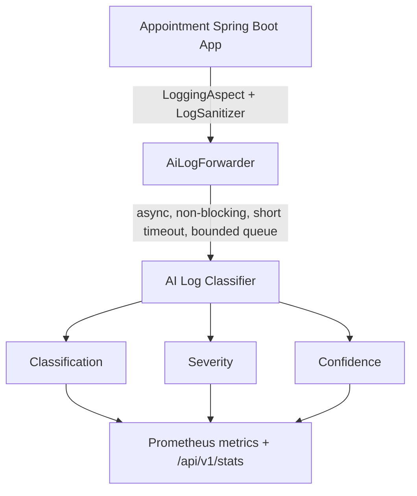

# AI Log Classification Service

An independent, auxiliary microservice that classifies application log lines
from the Appointment Booking system into operational categories with a
severity level and a confidence score. It is a pure observability add-on:
the appointment application works exactly the same whether this service is
running, degraded, or completely down.

## 1. Architecture



The Spring Boot app's existing `LoggingAspect` (AspectJ, around every
controller/service call) is the log source. Before anything is logged or
forwarded, `LogSanitizer` (Java side) and `app/security/sanitizer.py`
(Python side) strip passwords, JWTs, and other secret-shaped values -
defense in depth, not just one layer.

`AiLogForwarder` pushes sanitized log lines onto a small bounded queue and
a background thread ships them to this service over HTTP with an 800ms
timeout. If the AI service is slow, unreachable, or returns an error, the
failure is swallowed and logged at debug level only - it never reaches
appointment-booking code.

## 2. Why this approach, and what was rejected

- **No message broker (Kafka/RabbitMQ).** At this scale, a single-replica
  app talking to a single-replica classifier, a broker adds operational
  complexity with no real benefit. The bounded queue + async HTTP call
  gives the same "never block the caller" guarantee more simply.
- **No Fluent Bit/Filebeat/Logstash.** The app already has a custom
  AspectJ-based `LoggingAspect` as its log source; adding a log-shipping
  agent on top would be a second, competing logging path. Forwarding
  directly from the aspect keeps there being exactly one path.
- **No WebFlux dependency for the HTTP call.** The forwarder uses the
  JDK's built-in `java.net.http.HttpClient` instead of adding
  `spring-webflux` just to get `WebClient`, since the app already mixes
  Spring MVC + WebSocket + Security config and a second reactive stack
  isn't needed for one outbound call.

## 3. Model

- **Features:** TF-IDF (unigrams + bigrams) over a normalized version of
  the log text - see `app/preprocessing/pipeline.py`. Volatile tokens
  (timestamps, IPs, UUIDs, JWTs, URLs, hex blobs, numbers) are replaced
  with stable placeholders so the model learns the *shape* of a log line,
  not one-off values.
- **Algorithm:** Logistic Regression, chosen after comparing against
  Multinomial Naive Bayes, a calibrated Linear SVM, and Random Forest on
  a held-out validation split (see `model/evaluation_report.txt` for the
  full comparison). Logistic Regression was selected because it matched
  or beat the alternatives on macro-F1 while being the fastest to train,
  natively probabilistic (no calibration wrapper needed for confidence
  scores), and easy to explain (per-class linear coefficients).
- **Categories:** `INFO`, `WARNING`, `APPLICATION_ERROR`, `DATABASE_ERROR`,
  `AUTHENTICATION_ERROR`, `AUTHORIZATION_ERROR`, `VALIDATION_ERROR`,
  `NETWORK_ERROR`, `PERFORMANCE_WARNING`, `SECURITY_ALERT`,
  `SYSTEM_ERROR`, `UNKNOWN`.
- **Severity** is a separate, hand-configured mapping
  (`app/services/severity.py`) from category to `LOW`/`MEDIUM`/`HIGH`/
  `CRITICAL` - it is policy, not something the model predicts.

### Dataset

`training/dataset.csv` (3,120 rows, 260 per category, generated by
`training/generate_dataset.py`) is **entirely synthetic**, hand-templated
to resemble this specific application's actual log shapes (JWT auth,
MySQL/Hibernate errors, appointment/service/schedule domain objects,
roles `ADMIN`/`STAFF`/`CUSTOMER`). It contains no real user data or
credentials.

**Known limitation:** because the dataset is template-generated, some
categories (e.g. `VALIDATION_ERROR`, `DATABASE_ERROR`) have fewer unique
underlying sentence patterns than others (e.g. `INFO`, `AUTHORIZATION_ERROR`),
which is part of why held-out accuracy is very high (99.8%) - the model is
partly learning template structure, not the full diversity of real
production logs. It generalized correctly on 6 independently-written test
sentences that were not part of the dataset (see acceptance testing
below), but real accuracy in production will be lower until
`dataset.csv` is supplemented or replaced with real, sanitized production
logs. Retrain with `python training/train.py` after updating the dataset.

### Retraining

```bash
cd ai-log-classifier
python training/generate_dataset.py   # only if regenerating the synthetic set
python training/train.py
```

Outputs `model/classifier.pkl`, `model/vectorizer.pkl`,
`model/metadata.json` (with real, non-fabricated metrics), and
`model/evaluation_report.{json,txt}`.

## 4. API

### `POST /api/v1/classify`
```json
{"log": "Failed to connect to PostgreSQL database"}
```
```json
{
  "classification": "DATABASE_ERROR",
  "severity": "HIGH",
  "confidence": 0.96,
  "low_confidence": false,
  "sanitized_log": "Failed to connect to PostgreSQL database",
  "model_version": "1.0.0",
  "processing_time_ms": 0.6,
  "message": "The log appears to indicate a database connectivity or query failure."
}
```

### `POST /api/v1/classify/batch`
```json
{"logs": ["User successfully logged in", "Invalid JWT token"]}
```
Returns `{"results": [...], "count": 2}`.

### `GET /health`
```json
{"status": "UP", "model_loaded": true, "model_version": "1.0.0"}
```

### `GET /metrics`
Prometheus exposition format - `total_logs_processed`,
`classification_count_by_category`, `classification_errors`,
`low_confidence_predictions`, `security_alert_count`,
`inference_time_seconds`.

### `GET /api/v1/stats`
Last 50 classifications (for a simple dashboard), no database needed.

**Status codes:** `200` OK, `400` bad input (empty/oversized log,
missing/invalid batch), `422` malformed JSON / schema mismatch, `429`
rate limited, `500` internal error (never includes a stack trace), `503`
model not loaded.

## 5. Security

- Passwords, tokens, JWTs, and Bearer headers are redacted **before**
  storage or classification (`app/security/sanitizer.py`), and on the
  Java side before they're even written to the app's own logs
  (`LogSanitizer.java`).
- Input length and batch size are capped (`MAX_LOG_LENGTH`,
  `MAX_BATCH_SIZE`); requests over the limit are rejected with `400`.
- No dynamic evaluation of log content - it is only ever tokenized and
  vectorized, never executed or interpolated into a query/template.
- No stack traces are ever returned via the API; all internal errors are
  logged server-side and returned as a generic `500`.
- Simple in-memory per-IP rate limiting (no external store needed at
  this scale).
- Runs as a non-root user in its container; the runtime image excludes
  training-only dependencies (pandas etc.) - see the Dockerfile's
  trainer/runtime multi-stage split.
- Not published on a host port by default in `docker-compose.yml` -
  reachable only from other containers on `network-appointment`.

## 6. Testing

29 automated tests, all passing (`python -m pytest tests/ -v`):
`tests/test_preprocessing.py`, `tests/test_sanitizer.py`,
`tests/test_severity.py`, `tests/test_api.py` (valid request, empty log,
missing field, oversized log, malformed JSON, batch request, low-confidence/
unknown log, secret-redaction-in-response, no-stack-trace-leakage).

The service was also manually verified against all six of the original
acceptance-criteria examples, phrased independently of the training
templates:

| Input | Classification | Severity |
|---|---|---|
| "User logged in successfully" | INFO | LOW |
| "Connection refused while connecting to PostgreSQL" | DATABASE_ERROR | HIGH |
| "Invalid JWT token" | AUTHENTICATION_ERROR | HIGH |
| "Multiple failed login attempts detected from the same IP" | SECURITY_ALERT | CRITICAL |
| "Appointment API request took 4.2 seconds" | PERFORMANCE_WARNING | MEDIUM |
| "Completely unrelated unknown event" | UNKNOWN | LOW |

All six matched the expected category/severity.

## 7. Limitations & future improvements

- Dataset is synthetic; needs real (sanitized) production logs over time.
- Single-replica in-memory rate limiter and alert aggregator - fine at
  this scale, would need a shared store (Redis) if this service is ever
  scaled horizontally.
- No online learning / drift detection - retraining is a manual,
  explicit step (`training/train.py`), by design (spec section 27/31).
- Possible future work: transformer-based classification for messier
  real-world logs, anomaly detection for entirely novel failure modes,
  a real alert delivery integration (Slack/PagerDuty) beyond the
  pluggable `ALERT_WEBHOOK_URL` hook, and a small dashboard UI on top of
  `/api/v1/stats`.
